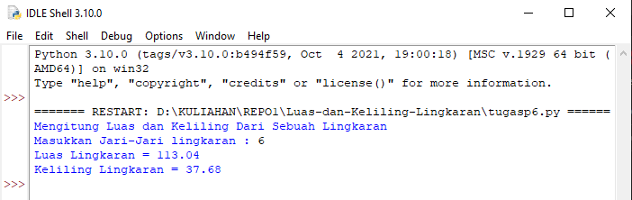

# Luas-dan-Keliling-Lingkaran
Program Mencari Luas dan Keliling Sebuah Lingkaran
Iman Setiawan

Ini adalah code pyhton saya
Sangat sederhana
~~~
# Program Hitung Luas dan Keliling Lingkaran

# Input Nilai
print('Mengitung Luas dan Keliling Dari Sebuah Lingkaran')
jari = input('Masukkan Jari-Jari lingkaran : ')
pi = 3.14

# Rumus Luas dan Keliling
luas = float(pi) * float(jari) * float(jari)
keliling = 2 * float(pi) * float(jari)

# Output
print('Luas Lingkaran =', round(luas,2))
print('Keliling Lingkaran =', round(keliling,2))
~~~

Dan ini adalah hasil output nya
Saya menggunakan fungsi Round untuk membulatkan desimalnya.

